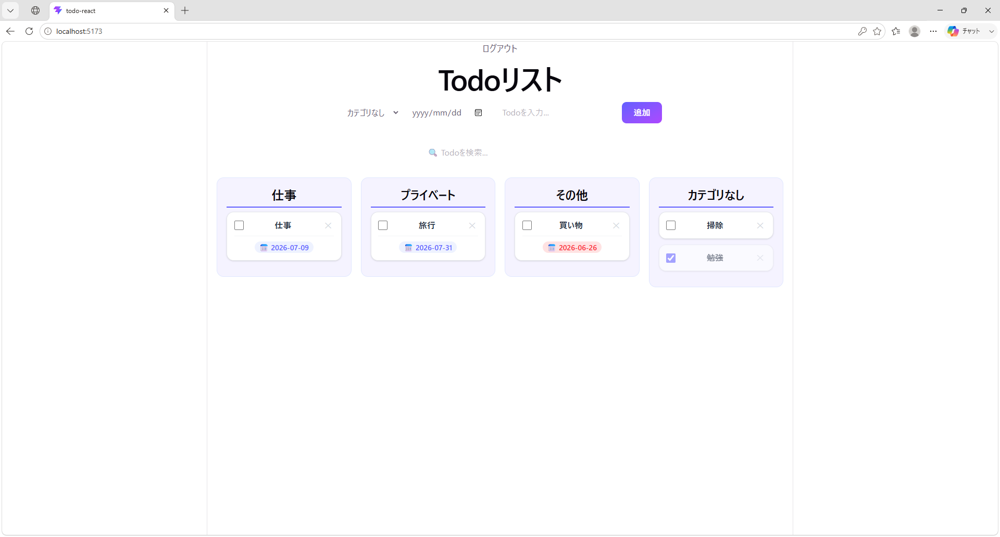
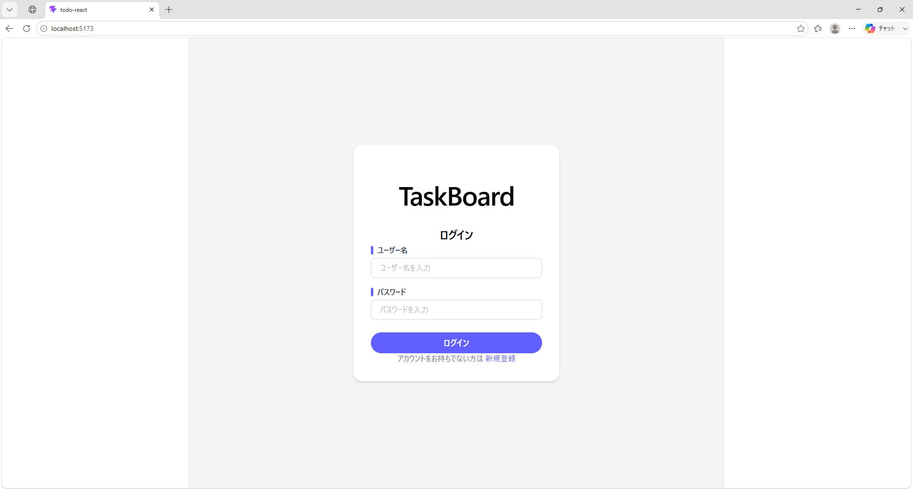
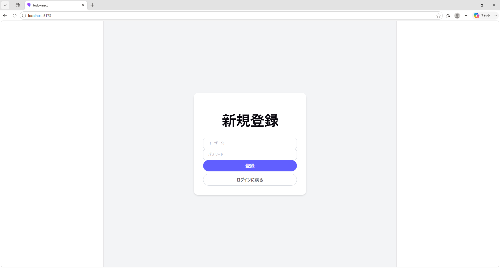

# TaskBoard

タスクをカテゴリ毎に分け、完了・未完了を判別可能な、Trello風のTodoアプリです。
バックエンドはDjango REST Frameworkで構築し、フロントエンドとAPIで連携しています。

---

## v2.0 React版 (最新)





## v1.0 Vanilla JS版


## 使用技術

- HTML
- CSS
- JavaScript
- Python
- Django
- Django REST Framework
- SQLite
- React
- Tailwind CSS

## 機能一覧

- タスクの追加、削除
- タスクカテゴリ分け
- 完了、未完了のチェック
- タスクの並び替え（完了済は下へ、未完了は上へ表示される）
- タスク期限日の表示
- ユーザー認証 (JWT)
- ログイン・ログアウト・新規登録
- インライン編集
- 期限切れ警告 (未完了かつ期限切れのタスクを赤表示)
- リアルタイム検索 (大文字小文字を区別しない)
- レスポンシブ対応 (スマホ縦並び・PC横並び)
- ローディング表示


## セットアップ方法

### バックエンド（Django）

1. リポジトリをクローンする
```bash
   git clone https://github.com/Compass539/todo-app-django.git
   cd todo-app-django
```

2. 仮想環境を作成・有効化する
```bash
   python -m venv venv
   venv/Scripts/activate 
```

3. ライブラリをインストールする
```bash
   pip install -r requirements.txt
```

4. マイグレーションを実行する
```bash
   python manage.py makemigrations
   python manage.py migrate
```

5. サーバーを起動する
```bash
   python manage.py runserver
```

6. 管理者アカウントを追加する(初回のみ)
```bash
   python manage.py createsuperuser
```


### フロントエンド（React）

1. todo-reactフォルダに移動する
```bash
   cd todo-react
```

2. ライブラリをインストールする
```bash
   npm install
```

3. 開発サーバーを起動する
```bash
   npm run dev
```


## 工夫した点

- フロントエンドとバックエンドをDjango REST Frameworkで連携させた
- Trello風のカラムレイアウトを実装し、視覚的にタスクを管理しやすくした
- カテゴリ・期限日などの機能を追加し、実用性を高めた
- コンポーネント分割（TodoForm・Column・Card）により、機能ごとに責任を分割し、保守性を高めた
- Reactのstate管理により、手動DOM操作をなくし、データと画面の同期を自動化した
- 期限切れ警告・リアルタイム検索・ローディング表示など、実用的な機能を追加しUXを向上させた
- Tailwindによりデザインが統一され、調整時のファイルの行き来をなくし業務効率化をした
- JWT認証によるユーザーごとのデータ管理を実装した 

## 今後の展望

- カレンダー機能の追加
- ドラッグ&ドロップでカラム間移動を追加
- AIとAPIを連携させ、タスク遂行に関するアドバイスを行う機能の実装
- デプロイ