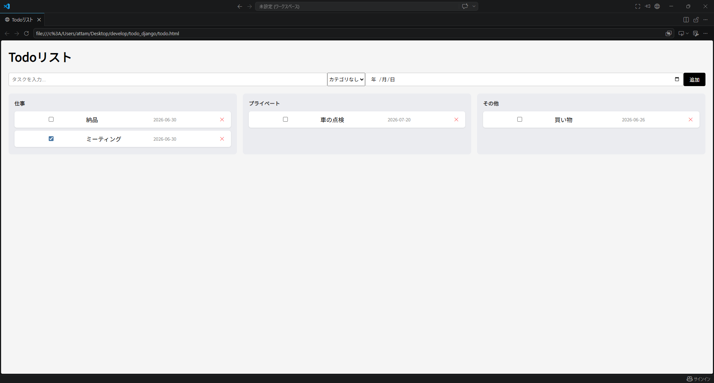

# TaskBoard

タスクをカテゴリ毎に分け、完了・未完了を判別可能な、Trello風のTodoアプリです。



## 使用技術

- HTML
- CSS
- JavaScript
- Python
- Django
- Django REST Framework
- SQLite

## 機能一覧

- タスクの追加、削除
- タスクカテゴリ分け
- 完了、未完了のチェック
- タスクの並び替え（完了済は下へ、未完了は上へ表示される）
- タスク期限日の表示

## セットアップ方法

1. リポジトリをクローンする

```bash
   git clone https://github.com/Compass539/todo-app-django.git
   cd todo-app-django
```

2. 仮想環境を作成する

```bash
   python -m venv venv
```

3. 仮想環境を有効化する

```bash
   venv/Scripts/activate
```

4. ライブラリをインストールする

```bash
   pip install -r requirements.txt
```

5. マイグレーションを実行する

```bash
   python manage.py makemigrations
   python manage.py migrate
```

6. サーバーを起動する

```bash
   python manage.py runserver
```

7. フロントエンドを開く

    `todo.html`をブラウザで開いてください（VSCodeなどのエディタから直接開く方法を推奨します）


## 工夫した点
- フロントエンドとバックエンドをDjango REST Frameworkで連携させた
- Trello風のカラムレイアウトを実装し、視覚的にタスクを管理しやすくした
- カテゴリ・期限日などの機能を追加し、実用性を高めた

## 今後の展望

- React化
- ユーザー認証機能の追加
- AIとAPIを連携させ、タスク遂行に関するアドバイスを行う機能の実装
- デプロイ